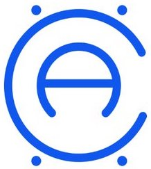

# Access (ACX) coin | network | crowdsale
> a self-governing, internally-incentivized cryptocurrency network for developing economies

<br>
<br>

<p align="center">
  
</p>

### Technical Definition
ACX is a ERC20-compliant token derived from the OpenZeppelin MintableToken

## Contracts
**coin**:
  * [AccessToken.sol](/contracts/AccessToken.sol): Core coin logic implementing MintableToken functionality

**network**:
  * [Relay.sol](/contracts/Relay.sol): Our slightly modified version of Consensys call forwarding contract for on-chain upgrades
  * [Governance.sol](/contracts/Governance.sol): Logic for voting on governance decision-module changes
  * [IncentivePool.sol](/contracts/IncentivePool.sol): Logic for dynamic generation and distribution of coins
  
**crowdsale**:
  * [AccessTokenSale.sol](/contracts/AccessTokenSale.sol): Implementation of our token sale
  * [AccessTokenVesting.sol](/contracts/AccessTokenVesting.sol): Our slightly modified version of OpenZeppelin's TokenVesting
  * [MultisigWallet.sol](): Consensys multisig wallet used for ACX Network funds and Atlas Underserved Exchange

## Technology
| software      | version       | purpose  |
| ------------- |:-------------:| -----:|
| [ethereum](https://github.com/ethereum "ethereum")    | => 0.8.0 | prod |
| [ganache cli](https://github.com/trufflesuite/ganache-cli) |  => 6.0.3 | dev |
| [solidity](https://github.com/ethereum/solidity "solidity") | => 0.4.2 | dev, prod |
| [nodejs](https://github.com/nodejs "nodejs")    | => 6.9.2 | dev, prod |
| [truffle](https://github.com/trufflesuite/truffle "truffle")    | => 4.0.1    | dev, prod |
| [zeppelin-solidity](https://github.com/OpenZeppelin/zeppelin-solidity "zeppelin-solidity")    | =>  1.3.0    | dev |

## Development

### prerequisites

```shell
git clone https://github.com/ACXNetwork/access-coin && cd access-coin
npm install -g truffle

```

### testing

to run our smart-contract tests you need to have [truffle](https://github.com/trufflesuite/truffle) installed on your machine. Our tests are written in javascript [here](/test). You can just run tests with following commands:

```
truffle test
```

## Guidelines and Best Practices

- fork, edit, and submit pull requests to the dev/non-master branch for any changes
- write comprehensive tests for all custom logic
- comply with ethereum smart contract security [best practices](https://consensys.github.io/smart-contract-best-practices/) and OpenZeppelin [standards](https://github.com/OpenZeppelin/zeppelin-solidity)
- utilize [SemVer](http://semver.org/) for versioning
- sign each commit with publicly available and easily identifiable gpg key
- tag releases and make readily comprehensible notes for each release

## Documentation
besides this readme, in depth documentation and introduction can be found in our [wiki](https://github.com/ACXNetwork/access-coin/wiki)

## Support and Community
1. [telegram](https://t.me/ACX_network)
2. [reddit](https://www.reddit.com/r/ACX_Network/)
3. [twitter](https://twitter.com/ACX_network)
4. [github](https://github.com/ACXnetwork)
5. [web](https://acxnetwork.com)

## Licensing

standard MIT license
